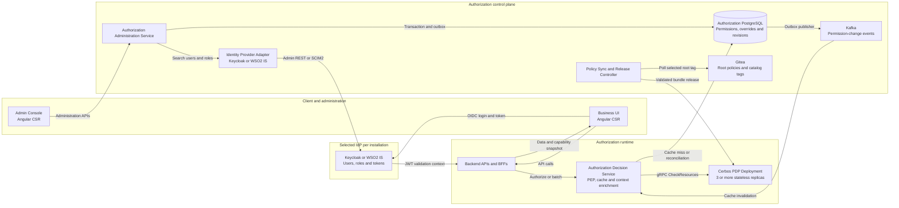
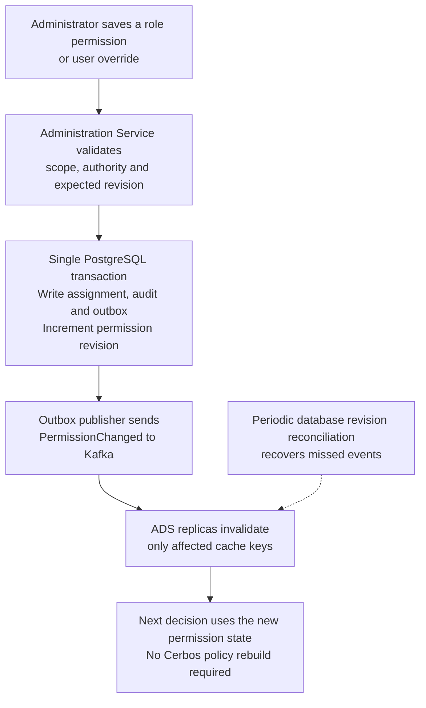
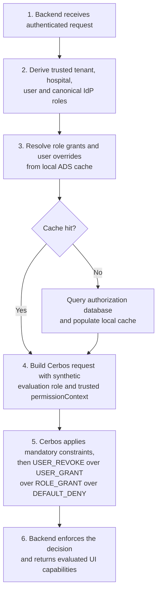
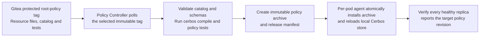

**Cerbos Multi-Tenant  
Authorization Platform**

**Comprehensive Architecture and Design Document**

> **Design status**
>
> Proposed target architecture for a dedicated Cerbos deployment in Kubernetes, supporting multiple tenants, a selectable Keycloak or WSO2 Identity Server integration, dynamic role and user permissions, and Angular CSR capability rendering.

| **Document field**      | **Value**                                                   |
|-------------------------|-------------------------------------------------------------|
| Version                 | 1.3                                                         |
| Date                    | 2 August 2026                                                |
| Status                  | Revised architecture proposal—native Markdown only                                       |
| Primary decision engine | Cerbos PDP                                                  |
| Deployment model        | Dedicated, horizontally scaled Kubernetes deployment        |
| Identity provider       | Keycloak or WSO2 Identity Server, selected per installation |
| Diagram format          | Inline Mermaid; no external image assets required              |

**Primary design principle**

*Cerbos owns authorization decision logic. The authorization database
owns dynamic assignments. Backend services remain the policy enforcement
points. The browser receives capabilities for rendering only and is
never the security boundary.*

# 1. Executive summary

This design establishes a centralized, installation-level authorization
platform based on a dedicated Cerbos Policy Decision Point (PDP)
deployment in Kubernetes. One deployment serves multiple tenants and
hospitals. Each installation integrates with exactly one identity
provider implementation: Keycloak or WSO2 Identity Server.

The solution separates stable authorization logic from dynamic
permission assignments. Stable rules, resource definitions, mandatory
constraints and the resource-action catalog are maintained as versioned
root policy assets in Gitea. Dynamic role permissions and user-specific
overrides are stored in PostgreSQL and made available to the decision
path through a high-throughput Authorization Decision Service.

Permission precedence is deterministic: mandatory platform restrictions
are always evaluated first; then a user-specific revocation overrides
all role grants; a user-specific grant overrides the absence of role
permission; otherwise any enabled role grant allows the action; and the
default is deny.

> **Key architectural decision**
>
> Role and user permission changes do not rebuild or reload Cerbos policies. They update versioned assignment data and invalidate authorization caches. Cerbos policy releases occur only when root resource logic, resource schemas, or the resource-action catalog changes.

## 1.1 Recommended component model



*Figure 1 - Recommended installation architecture*

## 1.2 High-level outcomes

- One Cerbos PDP fleet serves many tenants without maintaining a
  separate policy repository for every tenant.

- Keycloak and WSO2 Identity Server are hidden behind a provider-neutral
  Identity Directory Adapter.

- A three-state user override model (inherit, grant, revoke) guarantees
  user-specific priority over role-level permissions.

- Angular route changes use in-memory snapshots of **composite UI capabilities**. Each capability may require several resource-action decisions, which are evaluated and combined by the backend before the snapshot is returned.

- Backend APIs always re-evaluate authorization using trusted resource
  context; UI hiding or disabling is never treated as enforcement.

- Permission updates propagate through PostgreSQL transactions, an
  outbox, Kafka invalidation and revision reconciliation.

- Root policy releases are immutable, tested, atomically installed and
  verified across healthy Cerbos replicas.

# 2. Scope, goals and non-goals

## 2.1 Goals

- Deploy Cerbos as a dedicated, highly available Kubernetes workload.

- Support multiple tenants and multiple hospitals per tenant in one
  installation.

- Integrate with Keycloak or WSO2 Identity Server without changing the
  administration UI or authorization-domain model.

- Provide a dynamic role-resource-action matrix per tenant.

- Provide user-specific grant and revoke overrides scoped by tenant,
  hospital, user, resource and action.

- Provide an administration console for role permissions, user
  overrides, simulation, revision history and audit review.

- Support fast Angular CSR route rendering, component visibility and
  action enablement.

- Meet high-throughput requirements without placing PostgreSQL, Kafka or
  the identity provider in every warm authorization request.

- Remain available for authorization decisions during control-plane, IdP
  administration API, Gitea or Kafka outages.

## 2.2 Non-goals

- Cerbos does not authenticate users or issue access tokens.

- The administration platform does not manage passwords or replace the
  IdP user lifecycle.

- Browser-side route guards are not an enforcement boundary.

- This design does not store high-frequency business state such as
  patient ownership or encounter status in policy files.

- This design does not expose the Cerbos Admin API or PDP directly to
  browser clients.

- This design does not treat disabled role permissions as explicit
  user-level denials; user revocation is modeled separately.

# 3. Requirements and design decisions

| **Requirement**                | **Design response**                                                                                    |
|--------------------------------|--------------------------------------------------------------------------------------------------------|
| Dedicated Cerbos in Kubernetes | Deployment with 3 or more stateless replicas, internal services, HPA, PDB and topology spread.         |
| Multiple tenants               | Tenant and hospital are trusted request attributes. Assignment data is tenant-partitioned.             |
| Selectable IdP                 | Provider adapter selected by installation configuration; one active provider per installation.         |
| Dynamic role matrix            | Stored in PostgreSQL and cached in the Authorization Decision Service.                                 |
| Enable/disable permissions     | Role permission is enabled/disabled. User permission is inherit/grant/revoke with validity dates.      |
| User over role priority        | Mandatory deny \> user revoke \> user grant \> any role grant \> default deny.                         |
| Admin console                  | Angular CSR plus backend administration APIs; IdP calls are server-side.                               |
| UI rendering                   | Capability snapshot for module/route checks; instance action decisions returned with API data.         |
| High throughput                | gRPC, batching, local caches, Kafka invalidation, no per-route PDP call and no DB lookup on warm path. |

## 3.1 Why dynamic assignments are data, not policy files

A role-permission matrix and user-specific exceptions change more
frequently than root authorization logic. Converting every matrix change
into YAML, compiling a policy repository and reloading a PDP fleet
creates unnecessary latency and policy churn. It also complicates
user-over-role precedence because Cerbos role policies can only restrict
resource-policy access and principal-policy allows are final before the
resource policy is consulted \[R1\]\[R2\].

The recommended model therefore keeps permission assignments in an
application-owned database. The Authorization Decision Service resolves
the assignment for the exact requested action and supplies trusted
permission context to a stable resource policy. This preserves Cerbos as
the PDP while keeping dynamic state out of the policy release lifecycle.

# 4. Logical architecture

## 4.1 Component responsibilities

| **Component**                        | **Responsibility**                                                                                                                     |
|--------------------------------------|----------------------------------------------------------------------------------------------------------------------------------------|
| Admin Console UI                     | Angular CSR for browsing resources/actions, IdP users/roles, editing assignments, simulation and audit views.                          |
| Authorization Administration Service | Validates administrator authority, writes assignments transactionally, publishes outbox events, exposes revision and audit APIs.       |
| Identity Directory Adapter           | Normalizes Keycloak Admin REST or WSO2 SCIM2 data into common user and role records.                                                   |
| Authorization Decision Service (ADS) | Runtime PEP service. Resolves cached permissions, enriches Cerbos requests, batches calls, returns decisions and capability snapshots. |
| Authorization PostgreSQL             | Authoritative store for role permissions, user overrides, installation configuration, revisions and audits.                            |
| Kafka                                | Near-real-time cache invalidation and permission-change notification; not the source of truth.                                         |
| Policy Sync / Release Controller     | Polls Gitea, validates root policy releases, creates immutable archives and coordinates Cerbos activation.                             |
| Cerbos PDP                           | Evaluates resource policies and returns authorization decisions. Stateless and horizontally scalable.                                  |
| Backend APIs / BFFs                  | Enforcement points. They provide trusted resource attributes and deny requests when Cerbos denies.                                     |

## 4.2 Trust boundaries

- The browser is untrusted. Tenant IDs, hospital IDs, roles and user
  override data supplied by the browser are ignored.

- The API/BFF derives tenant and hospital context from verified
  identity, server-side selection state and loaded resource ownership.

- Only the Authorization Decision Service constructs the
  permissionContext sent to Cerbos.

- The Admin Console never receives IdP administrative credentials,
  database credentials, bundle signing keys or Cerbos Admin credentials.

- Cerbos accepts requests only from trusted internal workloads through
  NetworkPolicy and preferably mTLS.

# 5. Multi-tenant and hospital context model

## 5.1 Hierarchy

```text
Installation
├── Tenant A
│   ├── Hospital A1
│   └── Hospital A2
└── Tenant B
    └── Hospital B1
```

A tenant is the highest authorization partition inside an installation.
A hospital is an operational scope within a tenant. Role permissions are
shared by all hospitals in a tenant unless an optional condition narrows
them. User-specific overrides are explicitly hospital-scoped.

## 5.2 Required trusted decision attributes

| **Attribute**                   | **Purpose**                                                                                   |
|---------------------------------|-----------------------------------------------------------------------------------------------|
| principal.id                    | Stable IdP user identifier, not mutable username.                                             |
| principal.attr.tenantId         | Selected and validated tenant.                                                                |
| principal.attr.hospitalId       | Selected and validated hospital.                                                              |
| principal.attr.idpRoles         | Canonical role identifiers resolved from verified token claims.                               |
| resource.attr.tenantId          | Tenant that owns the resource.                                                                |
| resource.attr.hospitalId        | Hospital that owns or controls the resource.                                                  |
| resource.attr.permissionContext | Trusted sets of role-granted, user-granted and user-revoked actions for this resource.        |
| resource business attributes    | Status, ownership, department, sensitivity, workflow state and other mandatory-policy inputs. |

> **Tenant isolation invariant**
>
> Every resource policy must require `principal.tenantId == resource.tenantId`. Hospital-specific operations must additionally require `principal.hospitalId == resource.hospitalId` unless the action is explicitly designed for cross-hospital access.

## 5.3 Cerbos scope usage

The initial implementation should not generate one scoped resource
policy per tenant. The common root policy is shared, while tenant and
hospital differences are expressed through trusted permission and
resource attributes. This avoids policy count growth and makes
permission changes data-only. Cerbos scoped policies remain available
for future tenant-specific rule logic that cannot be represented safely
as constrained configuration \[R8\].

# 6. Authorization domain model

## 6.1 Resource, action and UI-capability catalogs

Each logical business resource has one root resource-policy file containing all supported actions and mandatory constraints. Cerbos resource policies are defined for a single resource kind, and each policy must be maintained independently [R3].

```text
authorization-root/
├── catalog/
│   ├── resources/
│   │   ├── patient_record.yaml
│   │   ├── clinical_note.yaml
│   │   └── prescription.yaml
│   └── ui-capabilities/
│       ├── clinical.yaml
│       └── pharmacy.yaml
├── policies/
│   └── resources/
│       ├── patient_record.yaml
│       ├── clinical_note.yaml
│       └── prescription.yaml
├── schemas/
├── tests/
└── release.yaml
```

The resource/action catalog is the administration-facing metadata source for role and user permission assignments. It contains labels, descriptions, grouping, context type and risk metadata. It must **not** use an action-to-UI-capability list as the authoritative mapping because that models the relationship in the wrong direction.

```yaml
resource: patient_record
version: v1
displayName: Patient record
domain: clinical
actions:
  - key: list
    displayName: List patients
    context: COLLECTION
  - key: read
    displayName: View patient
    context: INSTANCE
  - key: read:clinical
    displayName: View clinical information
    context: INSTANCE
    sensitivity: HIGH
  - key: update
    displayName: Update patient
    context: INSTANCE
  - key: delete
    displayName: Delete patient
    context: INSTANCE
    risk: CRITICAL
```

### Composite UI-capability catalog

A UI capability is an application-owned expression over **one or more** resource-action permission requirements. A capability becomes active only when its complete expression evaluates to true. The default composition is `allOf`; `anyOf` may be used where the product intentionally supports alternative permission paths.

```yaml
module: clinical
capabilities:
  - key: patient.route.edit
    displayName: Open patient editing route
    context: INSTANCE
    expression:
      allOf:
        - permission:
            resource: patient_record
            action: read
            targetRef: patient
        - permission:
            resource: patient_record
            action: update
            targetRef: patient
        - permission:
            resource: clinical_note_collection
            action: list
            targetRef: patientClinicalNotes

  - key: patient.component.clinical-summary
    displayName: Render complete clinical summary
    context: INSTANCE
    expression:
      allOf:
        - permission:
            resource: patient_record
            action: read:clinical
            targetRef: patient
        - permission:
            resource: clinical_note_collection
            action: list
            targetRef: patientClinicalNotes
        - permission:
            resource: lab_result_collection
            action: list
            targetRef: patientLabResults

  - key: patient.button.create-order
    displayName: Enable create-order button
    context: INSTANCE
    expression:
      allOf:
        - permission:
            resource: patient_record
            action: read
            targetRef: patient
        - anyOf:
            - permission:
                resource: medication_order
                action: create
                targetRef: medicationOrderCollection
            - permission:
                resource: laboratory_order
                action: create
                targetRef: laboratoryOrderCollection
```

Key rules:

- Tenant administrators assign permissions only at the resource-action level. They do not directly activate UI capabilities.
- The application team owns and versions capability expressions with the UI and root authorization catalog.
- A single capability may require permissions across several resources.
- One resource-action permission may contribute to many capabilities.
- Each leaf permission is evaluated using the normal mandatory-rule and user-over-role precedence before capability composition occurs.
- `targetRef` is resolved by trusted backend code to a collection or resource instance with server-loaded attributes; it is never trusted from browser-supplied authorization data.
- CI must validate that every referenced resource and action exists in the active resource catalog and that capability definitions contain no circular references.

## 6.2 Permission assignment types

| **Type**                              | **Scope key**                                | **State**                           | **Purpose**                                    |
|---------------------------------------|----------------------------------------------|-------------------------------------|------------------------------------------------|
| Role permission                       | tenant + canonical role + resource + action  | Enabled or disabled                 | Default source of business capability.         |
| User override                         | tenant + hospital + user + resource + action | INHERIT, GRANT or REVOKE            | Overrides the aggregate role result.           |
| Mandatory policy rule                 | resource policy + runtime attributes         | Allow precondition or explicit deny | Cannot be bypassed by role or user permission. |
| Instance-specific override (optional) | above key + resource instance ID or selector | GRANT or REVOKE                     | Use only for exceptional resource sharing.     |

## 6.3 Permission precedence

```text
if mandatory_security_rule_denies:
    DENY
else if user_override == REVOKE:
    DENY
else if user_override == GRANT:
    ALLOW
else if any_enabled_role_permission:
    ALLOW
else:
    DENY
```

> **Interpretation of “User specific >> Role specific”**
>
> A user override outranks the combined result of all assigned roles. It does not outrank tenant isolation, hospital isolation, legal constraints, resource-state restrictions, or other mandatory platform rules.

## 6.4 Why the runtime uses one synthetic Cerbos role

Cerbos conflict resolution is role-aware: deny wins for the same role,
but an allow from another role can still win across multiple roles
\[R1\]. To make the required precedence deterministic, the ADS passes
one internal role, for example sys:permission-evaluator, in
principal.roles. The real IdP roles are carried as attributes for audit
and optional policy conditions. The ADS precomputes action sets for role
grants, user grants and user revocations for the requested resource.

All allow and deny rules therefore evaluate against the same internal
role, ensuring a matching user-revoke deny wins over role and user-grant
allows. The browser and IdP are never allowed to assign the synthetic
role directly.

## 6.5 Root resource-policy pattern

```yaml
apiVersion: api.cerbos.dev/v1
resourcePolicy:
  resource: patient_record
  version: v1

  variables:
    local:
      same_tenant: >-
        request.principal.attr.tenantId == request.resource.attr.tenantId
      same_hospital: >-
        request.principal.attr.hospitalId == request.resource.attr.hospitalId
      role_actions: request.resource.attr.permissionContext.roleGrantedActions
      user_grants: request.resource.attr.permissionContext.userGrantedActions
      user_revokes: request.resource.attr.permissionContext.userRevokedActions

  rules:
    - name: revoke_read
      actions: ["read"]
      effect: EFFECT_DENY
      roles: ["sys:permission-evaluator"]
      condition:
        match:
          expr: '"read" in variables.user_revokes'

    - name: grant_read_to_user
      actions: ["read"]
      effect: EFFECT_ALLOW
      roles: ["sys:permission-evaluator"]
      condition:
        match:
          expr: >-
            "read" in variables.user_grants &&
            variables.same_tenant && variables.same_hospital

    - name: grant_read_to_role
      actions: ["read"]
      effect: EFFECT_ALLOW
      roles: ["sys:permission-evaluator"]
      condition:
        match:
          expr: >-
            "read" in variables.role_actions &&
            variables.same_tenant && variables.same_hospital

    - name: revoke_update
      actions: ["update"]
      effect: EFFECT_DENY
      roles: ["sys:permission-evaluator"]
      condition:
        match:
          expr: '"update" in variables.user_revokes'

    - name: grant_update_to_user_or_role
      actions: ["update"]
      effect: EFFECT_ALLOW
      roles: ["sys:permission-evaluator"]
      condition:
        match:
          expr: >-
            ("update" in variables.user_grants ||
             "update" in variables.role_actions) &&
            variables.same_tenant && variables.same_hospital &&
            request.resource.attr.status != "LOCKED"

    - name: locked_record_restriction
      actions: ["update", "delete"]
      effect: EFFECT_DENY
      roles: ["sys:permission-evaluator"]
      condition:
        match:
          expr: request.resource.attr.status == "LOCKED"

  schemas:
    principalSchema:
      ref: cerbos:///principal.json
    resourceSchema:
      ref: cerbos:///patient_record.json
```

Cerbos conditions are CEL expressions evaluated against principal and
resource attributes \[R9\]. Request schemas should reject malformed or
missing authorization attributes \[R10\].

# 7. Identity provider integration

## 7.1 Installation selection

```yaml
identityProvider:
  type: KEYCLOAK # KEYCLOAK or WSO2_IS
  baseUrl: https://identity.internal
  tenantMappingMode: REALM
  roleSource: CLIENT
  clientId: authorization-admin-service
  credentialsSecretRef: idp-admin-credentials
```

Only one provider adapter is active for an installation. The domain APIs
and Admin Console remain provider-neutral.

## 7.2 Adapter interface

```java
interface IdentityDirectory {
    Page<UserRef> searchUsers(TenantId tenant, UserSearch query);
    Page<RoleRef> searchRoles(TenantId tenant, RoleSearch query);
    Optional<UserRef> getUser(TenantId tenant, String externalId);
    Optional<RoleRef> getRole(TenantId tenant, String externalId);
    Set<String> resolveRuntimeRoles(VerifiedToken token, TenantId tenant);
}
```

## 7.3 Keycloak adapter

- Use the Keycloak Admin REST API from the backend to search users, list
  realm roles and list client roles \[R11\].

- Prefer stable role IDs and user IDs for persistence. Display names may
  change.

- Define whether authorization roles come from realm roles, a configured
  client, composites, or a normalized combination.

- Use a dedicated confidential service account with read-only user and
  role permissions.

## 7.4 WSO2 Identity Server adapter

- Use the SCIM2 Users API and SCIM2 Group/Role APIs from the backend
  \[R12\].

- Normalize WSO2 group or role identifiers into the same RoleRef model
  used for Keycloak.

- Use installation configuration to specify organization/tenant-domain
  mapping and the authoritative role API.

- Use a least-privileged machine identity; never proxy administrative
  credentials to the browser.

## 7.5 Canonical identifiers

```text
Keycloak realm role:  kc:<realm>:realm:<role-id>
Keycloak client role: kc:<realm>:<client-id>:<role-id>
WSO2 role/group:      wso2:<tenant-domain>:<role-id>
```

The database stores canonical identifiers plus display metadata.
Token-to-role normalization must produce exactly the same identifiers
used by the role-permission matrix.

# 8. Authorization data model

## 8.1 Core tables

```text
installation_config
  installation_id, idp_type, idp_config, active_root_tag

authorization_resource
  resource_key, version, display_name, domain, catalog_revision

authorization_action
  resource_key, action_key, display_name, context_type, risk_level

ui_capability_definition
  capability_key, module_key, context_type, expression_json,
  catalog_revision, enabled

role_permission
  tenant_id, role_external_id, resource_key, action_key,
  enabled, valid_from, valid_until, revision

user_permission_override
  tenant_id, hospital_id, user_external_id, resource_key, action_key,
  effect (GRANT|REVOKE), resource_instance_id nullable,
  valid_from, valid_until, enabled, revision

permission_revision
  tenant_id, revision, changed_at

permission_audit_event
  actor_id, operation, target_type, before_json, after_json,
  tenant_id, hospital_id, correlation_id, created_at

outbox_event
  event_id, aggregate_key, event_type, payload, created_at, published_at
```

## 8.2 Recommended constraints and indexes

- Unique role permission key: tenant_id + role_external_id +
  resource_key + action_key.

- Unique user override key: tenant_id + hospital_id + user_external_id +
  resource_key + action_key + resource_instance_id.

- Index active user overrides by tenant, hospital, user and validity
  period.

- Index role permissions by tenant and role ID.

- Use optimistic locking or expected revision for all matrix saves.

- Use database row-level security or application-enforced tenant
  predicates for administration queries.

- Retain append-only audit history even when the current assignment row
  is updated.

## 8.3 State semantics

| **State**          | **Meaning**                                                     |
|--------------------|-----------------------------------------------------------------|
| Role enabled       | The role contributes a grant.                                   |
| Role disabled      | The role contributes no grant; it is not an explicit deny.      |
| User INHERIT       | No override row, or override disabled; role result applies.     |
| User GRANT         | Allows when mandatory constraints pass, even if no role grants. |
| User REVOKE        | Denies even when one or more roles grant.                       |
| Expired assignment | Ignored by the ADS and eligible for cleanup/archive.            |

# 9. Administration console design

## 9.1 UI modules

| **Module**                 | **Functions**                                                                      |
|----------------------------|------------------------------------------------------------------------------------|
| Resource catalog           | Browse resources, actions, labels, risk and catalog revision.                      |
| Capability impact           | Show which composite UI capabilities depend on a selected resource-action permission. |
| Role matrix                | Select tenant and role; enable/disable resource-action permissions.                |
| User overrides             | Select tenant, hospital and user; set inherit/grant/revoke with expiry and reason. |
| Effective access simulator | Evaluate a user, hospital, resource, action and sample resource attributes.        |
| Revision and activation    | Display current permission revision, cache convergence and root-policy revision.   |
| Audit                      | Search changes by actor, user, role, resource, action, tenant and date.            |
| IdP diagnostics            | Show selected provider, connectivity and role/token mapping diagnostics.           |

## 9.2 Role matrix interaction

- Load role references from the selected IdP and resource/action
  metadata from the authorization catalog API.

- Group resources by business domain and actions by collection, instance
  and workflow context.

- Use checkboxes for role grants. A cleared checkbox means no grant, not
  an explicit deny.

- Show inherited or composite IdP roles as informational context, but
  persist assignments against stable canonical roles.

- Require an expected revision when saving to prevent one administrator
  overwriting another administrator's changes.

- Show an impact preview listing composite UI capabilities that may become enabled or disabled when the selected resource-action permission changes.

- For high-risk actions, optionally require maker-checker approval and a change ticket reference.

## 9.3 User override interaction

- Use a tri-state control: Inherit, Grant, Revoke.

- Require tenant, hospital, user, resource, action, reason, validity
  start and optional expiry.

- Default direct grants to a bounded expiry for high-risk permissions.

- Show the underlying role result and final effective result before
  saving.

- Warn when an override duplicates the existing role result and has no
  practical effect.

- Expose revocation as a first-class action; do not emulate it by
  removing roles from the IdP.

## 9.4 Administration API surface

| **Endpoint**                                                   | **Purpose**                                                   |
|----------------------------------------------------------------|---------------------------------------------------------------|
| GET /admin/authz/resources                                     | Catalog resources/actions and current root revision.          |
| GET /admin/authz/roles                                         | Search normalized IdP roles with pagination.                  |
| GET /admin/authz/users                                         | Search normalized IdP users with pagination.                  |
| GET /admin/authz/tenants/{t}/roles/{r}/permissions             | Read a role matrix slice.                                     |
| PUT /admin/authz/tenants/{t}/roles/{r}/permissions             | Replace role permissions using expected revision.             |
| GET /admin/authz/tenants/{t}/hospitals/{h}/users/{u}/overrides | Read user overrides.                                          |
| PUT /admin/authz/tenants/{t}/hospitals/{h}/users/{u}/overrides | Apply grant/revoke/inherit changes.                           |
| POST /admin/authz/simulate                                     | Run an effective resource-action decision through the runtime ADS and Cerbos. |
| POST /admin/authz/simulate-capabilities                        | Evaluate selected composite UI capabilities using supplied trusted sample context. |
| GET /admin/authz/audit                                         | Query administration audit history.                           |

# 10. Permission update and cache convergence



*Figure 2 - Dynamic permission update path*

## 10.1 Transactional update

1.  Validate the administrator permission to manage the target tenant,
    hospital, role or user.

2.  Validate the resource and action against the active authorization
    catalog.

3.  Validate the user and role identifiers through the IdP adapter or
    cached directory metadata.

4.  In one PostgreSQL transaction, update assignments, increment the
    tenant permission revision, write an audit event and insert an
    outbox event.

5.  The outbox publisher sends PermissionChanged to Kafka.

6.  Every ADS replica invalidates only the affected role or user cache
    keys.

7.  A periodic revision reconciler detects and repairs missed Kafka
    invalidations.

## 10.2 Event shape

```json
{
  "eventId": "01K...",
  "eventType": "PermissionChanged",
  "installationId": "inst-1",
  "tenantId": "tenant-a",
  "hospitalId": "hospital-1",
  "subjectType": "USER",
  "subjectId": "keycloak-user-id",
  "resource": "patient_record",
  "action": "update",
  "revision": 184,
  "occurredAt": "2026-07-30T12:00:00Z"
}
```

## 10.3 Consistency objective

Kafka provides the low-latency invalidation path. PostgreSQL remains
authoritative. Each ADS replica periodically compares the highest tenant
revision in its cache with the database revision. This combination
provides fast normal operation and recovery from lost events, rebalances
and temporary consumer outages.

> **Recommended SLO**
>
> A committed permission update should affect all healthy ADS replicas within five seconds for 99% of changes. Revocation latency must be measured separately and treated as the more critical objective.

# 11. Runtime authorization flow



*Figure 3 - Runtime authorization decision sequence*

## 11.1 Authorization request contract

```json
{
  "principal": {
    "id": "idp-user-123",
    "roles": ["sys:permission-evaluator"],
    "attr": {
      "tenantId": "tenant-a",
      "hospitalId": "hospital-1",
      "idpRoles": ["kc:realm:client:doctor"]
    }
  },
  "resources": [
    {
      "resource": {
        "kind": "patient_record",
        "id": "patient-456",
        "policyVersion": "v1",
        "attr": {
          "tenantId": "tenant-a",
          "hospitalId": "hospital-1",
          "status": "ACTIVE",
          "permissionContext": {
            "roleGrantedActions": ["read", "update"],
            "userGrantedActions": ["read:clinical"],
            "userRevokedActions": ["update"],
            "permissionRevision": 184
          }
        }
      },
      "actions": ["read", "update"]
    }
  ]
}
```

Cerbos CheckResources supports batching multiple resources and multiple
actions. The documented defaults are up to 50 resources per request and
50 actions per resource, and changes to these limits can affect CPU,
memory and throughput \[R4\]\[R5\].

## 11.2 Authorization Decision Service cache model

| **Cache**             | **Key**                  | **Value**                                                      |
|-----------------------|--------------------------|----------------------------------------------------------------|
| Role permission cache | tenant + canonical role  | Set of enabled resource-actions and revision.                  |
| User override cache   | tenant + hospital + user | Grant/revoke map with validity and optional instance selector. |
| Catalog cache         | root policy revision     | Resource/action validation and capability mapping.             |
| IdP metadata cache    | provider + external ID   | Display names and active state; not token role authority.      |

- Use in-process caches on every ADS replica for the warm path.

- Use Kafka to invalidate affected keys, not to replicate full state.

- On cache miss, read PostgreSQL through pooled connections.

- Do not cache final mutation decisions longer than the underlying
  assignment and resource-state freshness window.

- Prewarm high-volume tenant role matrices during deployment or after
  leader-directed cache warmup.

## 11.3 Backend enforcement pattern

8.  Verify the access token and derive the installation, tenant,
    hospital, user and canonical IdP roles.

9.  Load the resource from its owning service or database before
    authorization when the decision depends on resource attributes.

10. Call the ADS with the required action or action batch.

11. Allow only an explicit Cerbos EFFECT_ALLOW result.

12. Log the application correlation ID, Cerbos call ID, permission
    revision and decision source.

13. Perform the business operation only after authorization. Re-check
    when a long-running workflow crosses a trust boundary.

# 12. Angular CSR composite-capability rendering

```mermaid
flowchart LR
    A[Angular route/component requests capability keys] --> B[Backend Capability Evaluator]
    B --> C[Load versioned capability expressions]
    C --> D[Resolve trusted targetRefs and resource attributes]
    D --> E[Deduplicate permission leaves]
    E --> F[Batch Cerbos CheckResources]
    F --> G[Apply user-over-role result to each permission leaf]
    G --> H[Evaluate allOf/anyOf expressions]
    H --> I[Return capability snapshot to Angular]
    I --> J[Signals, guards, components and buttons]
```



*Figure 4 - Composite Angular capability evaluation flow*

## 12.1 Capability semantics

A UI capability is not equivalent to one Cerbos resource-action pair. It is a named boolean expression whose leaf nodes are Cerbos permission decisions.

For capability `c` with required permission leaves `p1 ... pn`:

```text
ALL_OF capability: allowed(c) = allowed(p1) AND ... AND allowed(pn)
ANY_OF capability: allowed(c) = allowed(p1) OR  ... OR  allowed(pn)
```

Each leaf is evaluated first using the platform precedence:

```text
mandatory restriction > user REVOKE > user GRANT > role grant > default deny
```

Only after the leaf decisions are final does the backend evaluate the UI-capability expression. Capability composition does not change Cerbos permission semantics and must never create an allow that was absent from all required leaf decisions.

| **UI capability** | **Required resource-action permissions** | **Composition** | **Use** |
|---|---|---|---|
| `patients.route.list` | `patient_collection:list`, `hospital_context:read` | ALL | Render patient navigation and list route. |
| `patient.route.details` | `patient_record:read`, `patient_demographics:read` | ALL | Open a specific patient route. |
| `patient.route.edit` | `patient_record:read`, `patient_record:update`, `clinical_note_collection:list` | ALL | Open the complete edit route. |
| `patient.component.clinical-summary` | `patient_record:read:clinical`, `clinical_note_collection:list`, `lab_result_collection:list` | ALL | Render the complete clinical summary. |
| `patient.button.create-order` | `patient_record:read` AND (`medication_order:create` OR `laboratory_order:create`) | ALL + nested ANY | Enable a generic create-order control. |

A backend operation remains authorized against the operation's own business resource-action permission. For example, the update endpoint checks `patient_record:update` using trusted resource state even when the UI route capability also required read and clinical-note permissions. The composite capability is a UX aggregation, not a replacement for API enforcement.

## 12.2 Capability-definition contract

Capability definitions are versioned application configuration and are not tenant-editable. A normalized model is:

```typescript
export type PermissionRequirement = {
  resource: string;
  action: string;
  targetRef: string;
};

export type CapabilityExpression =
  | { permission: PermissionRequirement }
  | { allOf: CapabilityExpression[] }
  | { anyOf: CapabilityExpression[] };

export interface UiCapabilityDefinition {
  key: string;
  module: string;
  context: 'MODULE' | 'COLLECTION' | 'INSTANCE';
  expression: CapabilityExpression;
  catalogRevision: string;
}
```

Implementation constraints:

- `allOf` and `anyOf` arrays must be non-empty.
- Negation is not supported in the initial design; explicit denies belong in Cerbos and user override semantics.
- Capability-to-capability references are discouraged initially. If later introduced, CI must reject cycles and flatten the graph before runtime.
- Every permission leaf must resolve to a known catalog resource and action.
- `targetRef` must be resolved server-side from route context and resources loaded from authoritative services.

## 12.3 Backend evaluation algorithm

For a requested set of capability keys:

1. Load the definitions for the active capability-catalog revision.
2. Resolve each `targetRef` into a collection or resource instance and load trusted tenant, hospital and business attributes.
3. Flatten all expressions into permission leaves.
4. Deduplicate identical `(resource kind, resource id, action)` leaves across capabilities.
5. Resolve role grants and user overrides once for the relevant user, tenant and hospital.
6. Issue one or a small bounded number of Cerbos `CheckResources` requests containing all unique leaves.
7. Build a leaf-decision map.
8. Evaluate every capability expression in memory.
9. Return decisions plus revision and optional diagnostic evidence.

This changes the scaling characteristic from one PDP call per route/component/button to approximately one batched evaluation per module snapshot or loaded page context.

Example request to the backend capability evaluator:

```json
{
  "tenantId": "tenant-a",
  "hospitalId": "hospital-1",
  "module": "clinical",
  "capabilityKeys": [
    "patient.route.details",
    "patient.route.edit",
    "patient.component.clinical-summary"
  ],
  "context": {
    "patientId": "patient-456"
  }
}
```

The browser may provide routing identifiers such as `patientId`, but the backend must load the resource and derive its authorization attributes. The browser must not provide trusted permission decisions, tenant ownership or user overrides.

## 12.4 Capability snapshot

```json
{
  "authorizationRevision": 184,
  "rootPolicyRevision": "root-v1.4.0",
  "capabilityCatalogRevision": "ui-capabilities-v12",
  "tenantId": "tenant-a",
  "hospitalId": "hospital-1",
  "module": "clinical",
  "contextFingerprint": "sha256:4bce...",
  "capabilities": {
    "patient.route.details": {
      "allowed": true
    },
    "patient.route.edit": {
      "allowed": false,
      "reason": "REQUIRED_PERMISSION_DENIED",
      "failedRequirements": [
        {
          "resource": "patient_record",
          "action": "update",
          "target": "patient-456",
          "reason": "USER_REVOKED"
        }
      ]
    },
    "patient.component.clinical-summary": {
      "allowed": true
    }
  }
}
```

Failure evidence is optional and should be filtered for the audience. End-user responses normally contain a stable reason code, while the administration simulator may expose the complete requirement tree and leaf decisions.

The login or module snapshot contains only module- and collection-level capabilities that can be resolved without a concrete instance. Instance-level composite capabilities are returned when the backend loads the page's trusted resource context.

## 12.5 Angular integration

Angular consumes already-evaluated capability decisions and does not implement expression parsing or permission precedence.

```typescript
export interface CapabilityDecision {
  allowed: boolean;
  reason?: string;
}

@Injectable({ providedIn: 'root' })
export class CapabilityStore {
  private readonly state = signal<Record<string, CapabilityDecision>>({});

  can(key: string): boolean {
    return this.state()[key]?.allowed === true;
  }

  replace(snapshot: UiCapabilitySnapshot): void {
    this.state.set(snapshot.capabilities);
  }
}
```

```typescript
export const capabilityGuard: CanMatchFn = route => {
  const capabilities = inject(CapabilityStore);
  const router = inject(Router);
  const key = route.data?.['capability'] as string;
  return capabilities.can(key) ? true : router.parseUrl('/forbidden');
};
```

```html
@if (capabilityStore.can('patient.component.clinical-summary')) {
  <app-patient-clinical-summary [patientId]="patient.id" />
}

<button
  type="button"
  [disabled]="!capabilityStore.can('patient.route.edit')"
  (click)="openEditRoute()">
  Edit
</button>
```

Angular route guards remain UX controls only. Backend APIs must independently enforce the relevant resource-action permission because browser JavaScript can be modified [R13].

## 12.6 Frequent route changes and high-throughput CSR behavior

- Load a small module-level composite-capability snapshot at login, tenant switch or hospital switch.
- Fetch an instance-context snapshot once when a page resource is loaded; reuse it across child routes and tabs while its revision and context fingerprint remain valid.
- Split snapshots by lazy-loaded module rather than returning every installation capability at login.
- Route guards read Angular Signals synchronously and never call Cerbos for every navigation.
- Deduplicate permission leaves across all requested capabilities before calling Cerbos.
- Cache snapshots by user + tenant + hospital + module + context fingerprint + authorization revision + capability-catalog revision.
- Return authorization and capability-catalog revisions from backend APIs and refresh when either changes.
- If an API returns 403 because a snapshot became stale, invalidate the affected context snapshot and refresh once before showing the final denial.
- A lightweight server-sent event may notify the browser of a new authorization revision, but security never depends on this channel.
- Never fetch protected data and then hide it with CSS; the owning backend endpoint must deny the read operation.

## 12.7 Collection, instance and row decisions

| **Decision type** | **Example** | **Evaluation time** | **Frontend behavior** |
|---|---|---|---|
| Module/collection composite | `patients.route.list` requiring `patient_collection:list` + `hospital_context:read` | Module snapshot | Navigation and route availability. |
| Instance composite | `patient.route.edit` requiring read + update + related-note-list | Page resource load | Render route, tabs and controls. |
| Backend operation | `patient_record:update` | Every update API call | Enforce operation regardless of browser state. |
| Row-level composite | Row menu requiring read plus one or more workflow actions | Batch resource load and Cerbos check | Render row menus without N browser calls. |

# 13. Root policy lifecycle



*Figure 5 - Root policy release flow*

## 13.1 Source control and versioning

- Root policies, schemas, tests and the authorization catalog are stored
  in one internal Gitea repository.

- Production installations pin an immutable protected Git tag such as
  root-v1.4.0.

- The Policy Controller polls Gitea because Gitea cannot initiate
  connections into the application environment.

- A catalog or policy change is a root release and requires complete
  validation before activation.

- Dynamic role and user assignment changes do not touch Gitea and do not
  reload Cerbos.

## 13.2 Validation gate

14. Fetch the exact commit referenced by the selected Git tag.

15. Validate every catalog resource and action against the
    resource-policy repository.

16. Validate JSON schemas and required trusted attributes.

17. Run cerbos compile and all policy tests \[R6\].

18. Run generated invariants for tenant and hospital isolation and
    permission precedence.

19. Create an immutable tar.gz policy archive and a separate release
    manifest.

20. Install the archive atomically on each Cerbos pod and explicitly
    reload the local store.

21. Mark the release active only when all healthy replicas report the
    expected revision.

## 13.3 Rollback

A rollback activates the previous immutable root archive. Permission
assignment data remains unchanged. Because assignment data references
resource and action keys, a root release must preserve compatibility or
include an explicit data migration plan before activation.

# 14. Kubernetes deployment design

## 14.1 Namespace and workloads

| **Kubernetes object**                | **Design**                                                                         |
|--------------------------------------|------------------------------------------------------------------------------------|
| cerbos-pdp Deployment                | 3+ replicas, stateless decision engine, gRPC and HTTP internal ports.              |
| policy-agent sidecar                 | Downloads and verifies policy archive, atomically installs it, calls local reload. |
| Authorization Decision Service       | Horizontally scaled runtime PEP/context service.                                   |
| Authorization Administration Service | Admin APIs, DB writes, outbox, IdP adapter.                                        |
| Policy Sync Controller               | Leader-elected polling and root release orchestration.                             |
| Internal Services                    | ClusterIP only; no public Cerbos endpoint.                                         |
| NetworkPolicies                      | Restrict Cerbos calls to ADS or explicitly approved backend namespaces.            |

## 14.2 Cerbos deployment principles

- Use a dedicated Deployment rather than one sidecar per application,
  because one installation shares the same root policy and central
  permission infrastructure.

- Use at least three replicas across nodes or zones; configure a
  PodDisruptionBudget and topology-spread constraints.

- Use the official Helm chart as the packaging baseline \[R14\].

- Use the Cerbos healthcheck command for readiness and liveness probes
  \[R15\].

- Use gRPC for runtime checks and reuse long-lived channels.

- Expose HTTP only for health, metrics or tightly controlled
  administration needs.

- Do not require sticky sessions; Cerbos replicas are stateless when
  they run the same policy archive.

- Use read-only root filesystems, non-root execution, seccomp and
  dropped Linux capabilities.

## 14.3 Illustrative Helm values

```yaml
replicaCount: 3

service:
  type: ClusterIP
  httpPort: 3592
  grpcPort: 3593

cerbos:
  config:
    server:
      httpListenAddr: ":3592"
      grpcListenAddr: ":3593"
      metricsEnabled: true
      logRequestPayloads: false
      requestLimits:
        maxResourcesPerRequest: 50
        maxActionsPerResource: 50
    storage:
      driver: disk
      disk:
        directory: /var/run/cerbos/policies/current.tgz
    audit:
      enabled: true
      accessLogsEnabled: false
      backend: local

podDisruptionBudget:
  enabled: true
  minAvailable: 2

autoscaling:
  enabled: true
  minReplicas: 3
  maxReplicas: 20
  targetCPUUtilizationPercentage: 65

topologySpreadConstraints:
  - maxSkew: 1
    topologyKey: kubernetes.io/hostname
    whenUnsatisfiable: DoNotSchedule
```

The exact Helm value names must be validated against the chart version
selected by the implementation team. Initial resource requests and HPA
limits must be established by load testing rather than copied from
generic sizing guidance.

## 14.4 Cerbos Admin API exposure

The Cerbos Admin API is optional, currently uses a single basic-auth
administrator and may include breaking changes \[R7\]. It must not be
exposed through ingress. The preferred design is for a local
policy-agent sidecar to call the Admin API through localhost or a
pod-local channel using a secret available only to that pod.

# 15. Performance and scalability

## 15.1 Hot path

| Backend -\> Authorization Decision Service cache -\> Cerbos gRPC -\> Backend |
|------------------------------------------------------------------------------|

PostgreSQL, Kafka, Gitea and the IdP administration API are not part of
a warm authorization request. This is the primary scalability property
of the design.

## 15.2 Throughput optimizations

- Reuse gRPC channels and connection pools; do not create one client per
  request.

- Flatten requested UI-capability expressions, deduplicate resource-action leaves, and batch the unique checks within Cerbos request limits [R4][R5].

- Batch required actions for one resource and batch rows for list-page decisions within Cerbos request limits [R4][R5].

- Avoid logging full request payloads and sensitive resource attributes.

- Cache role matrices and user overrides locally with targeted Kafka
  invalidation.

- Keep Cerbos policies small and resource-oriented; avoid duplicating
  tenant-specific rules when data can express the difference.

- Evaluate composite capability expressions in the ADS after the batched Cerbos response and return the final capability decisions with business API responses.

- Use query-aware filtering or a Cerbos query-plan adapter for very
  large lists rather than retrieving inaccessible records and filtering
  them afterward.

- Measure decision latency with and without decision audit logging;
  Cerbos documents that audit logging has resource overhead \[R16\].

## 15.3 Suggested non-functional targets

| **Objective**            | **Target**                                                                                       |
|--------------------------|--------------------------------------------------------------------------------------------------|
| Availability             | 99.99% monthly for the combined ADS + Cerbos decision service.                                   |
| Warm decision latency    | Target p95 \<= 15 ms and p99 \<= 30 ms inside the cluster; validate under expected payloads.     |
| Cerbos engine time       | Measure separately from network and ADS cache time.                                              |
| Permission convergence   | 99% of committed permission updates visible on healthy ADS replicas within 5 seconds.            |
| Root release convergence | All healthy Cerbos replicas on one root revision before release is declared active.              |
| Capacity                 | Sustain 2x forecast peak authorization throughput during load test with acceptable tail latency. |
| Fail closed              | No business operation proceeds when an explicit allow cannot be obtained.                        |

## 15.4 Route-change scalability

Frequent Angular route changes are primarily a frontend state-management
concern, not a PDP-throughput concern. Module composite-capability snapshots make
route checks local and synchronous. Cerbos is called when a new resource
is loaded, when a backend action is attempted or when the capability
revision changes, not for every browser navigation event.

# 16. Security design

## 16.1 Mandatory controls

| **Area**       | **Control**                                                                                   |
|----------------|-----------------------------------------------------------------------------------------------|
| Network        | ClusterIP services, NetworkPolicy, mTLS where supported, no public PDP/Admin endpoint.        |
| Identity       | Validate token issuer, audience, expiry and signature; normalize only configured role claims. |
| Tenancy        | Server-derived tenant/hospital context and resource ownership checks in every root policy.    |
| Synthetic role | Added only by trusted ADS; reject it if observed in external token claims.                    |
| Administration | Separate admin permissions, MFA through IdP, maker-checker for high-risk changes.             |
| Secrets        | Kubernetes Secrets or enterprise secret manager; distinct IdP, DB and Cerbos credentials.     |
| Policy release | Protected tags, compile/tests, immutable archives, checksum/signature verification.           |
| Browser        | Capability rendering only; all API reads and writes are re-authorized server-side.            |

## 16.2 Sensitive healthcare data

- Send only attributes necessary for the decision; avoid patient names,
  diagnoses and free-text clinical data.

- Mask or omit sensitive attributes from Cerbos decision audit logs.

- Log stable identifiers and correlation IDs rather than full resource
  documents.

- Separate authorization administration audit from clinical access audit
  while retaining correlation between them.

- Require a reason, approver and expiry for high-risk user grants where
  policy requires it.

# 17. Observability and audit

## 17.1 Metrics

- ADS request rate, allow/deny/error rate and latency by
  resource/action.

- ADS cache hit ratios for role permissions and user overrides.

- PostgreSQL cache-miss query latency and connection-pool saturation.

- Kafka consumer lag and invalidation processing latency.

- Cerbos request rate, engine latency, error rate, CPU and memory.

- Current root revision and permission revision by replica.

- Stale-revision duration and number of replicas behind the target
  revision.

## 17.2 Correlation

Cerbos responses can include a cerbosCallId when audit logging is
enabled, and Cerbos recommends logging the ID in the application so
decision logs can be joined with application activity \[R16\]. The ADS
should also emit an application correlation ID, permission revision,
root policy revision, user override source and matched role IDs.

## 17.3 Audit categories

| **Audit category**     | **Examples**                                                                                   |
|------------------------|------------------------------------------------------------------------------------------------|
| Administration         | Role grant enabled/disabled, user grant/revoke/inherit, actor, before/after, reason, approval. |
| Policy release         | Git tag, commit, tests, bundle hash, per-replica activation.                                   |
| Authorization decision | Principal ID, tenant, hospital, resource/action, effect, decision source, revisions.           |
| Security operations    | IdP adapter failures, unauthorized admin attempts, synthetic-role validation failures.         |

# 18. Availability, failure modes and disaster recovery

| **Failure**          | **Required behavior**                                                                         |
|----------------------|-----------------------------------------------------------------------------------------------|
| Cerbos pod failure   | Kubernetes routes to another replica; no sticky session required.                             |
| ADS pod failure      | Service routes to another replica; caches warm on demand.                                     |
| PostgreSQL outage    | Warm cached decisions continue until configured safety threshold; cache misses fail closed.   |
| Kafka outage         | Permission writes remain committed; revision reconciler catches up after recovery.            |
| Gitea outage         | Existing root policy archive remains active.                                                  |
| IdP Admin API outage | Login may be separate; Admin Console user/role search degrades, runtime token roles continue. |
| Invalid root release | Compilation or tests fail; previous archive remains active.                                   |
| Partial root rollout | Release is not marked active; failing pod is removed from service or remediated.              |
| Missed invalidation  | Periodic permission-revision reconciliation invalidates stale caches.                         |

## 18.1 Database and bundle recovery

- Back up authorization PostgreSQL with point-in-time recovery and test
  restore procedures.

- Retain several previous immutable root policy archives and manifests.

- Store audit history according to the installation retention policy.

- On disaster recovery, restore the database, select the last known-good
  root archive and rebuild ADS caches.

- Do not make authorization runtime startup dependent on Gitea
  availability.

# 19. Testing strategy

| **Test layer**              | **Coverage**                                                                             |
|-----------------------------|------------------------------------------------------------------------------------------|
| Policy unit tests           | Every resource/action, tenant/hospital isolation, mandatory restrictions and precedence. |
| Generated invariants        | User revoke beats all roles; user grant beats no-role result; default deny.              |
| Schema tests                | Reject missing tenant, hospital, permissionContext and invalid data types.               |
| IdP adapter contract tests  | Keycloak and WSO2 pagination, role normalization and unavailable-provider behavior.      |
| Admin API integration tests | Optimistic concurrency, audit/outbox atomicity, tenant boundary enforcement.             |
| Runtime integration tests   | ADS cache hit/miss, Kafka invalidation, Cerbos decisions and backend enforcement.        |
| Capability composition tests | ALL/ANY expressions, multiple resources, targetRef resolution, deduplication and failure evidence. |
| Angular tests               | Route guards, directives, stale snapshot refresh and 403 handling.                       |
| Performance tests           | Peak QPS, batch sizes, large role sets, large user-override sets and root policy size.   |
| Chaos tests                 | Kill pods, pause Kafka, block DB, fail policy rollout and verify fail-closed behavior.   |

## 19.1 Minimum policy test matrix

| **Mandatory** | **User override** | **Role grant** | **Expected** |
|---------------|-------------------|----------------|--------------|
| Deny          | Any               | Any            | Deny         |
| Pass          | Revoke            | Grant          | Deny         |
| Pass          | Revoke            | No grant       | Deny         |
| Pass          | Grant             | No grant       | Allow        |
| Pass          | Grant             | Grant          | Allow        |
| Pass          | Inherit           | Grant          | Allow        |
| Pass          | Inherit           | No grant       | Deny         |

# 20. Deployment and implementation phases

| **Phase**                 | **Deliverables**                                                                                                     |
|---------------------------|----------------------------------------------------------------------------------------------------------------------|
| Phase 1 - Foundation      | Root policy repository, resource/action catalog, Cerbos Kubernetes deployment, policy release controller, basic ADS. |
| Phase 2 - Role matrix     | Authorization DB, Keycloak adapter, role matrix UI, outbox/Kafka invalidation, capability snapshot.                  |
| Phase 3 - User overrides  | Hospital-scoped grant/revoke/inherit, effective access simulator, audit and expiry jobs.                             |
| Phase 4 - WSO2 support    | WSO2 SCIM2 adapter and provider contract certification.                                                              |
| Phase 5 - Scale hardening | Load tests, HPA tuning, batch/query filtering, chaos testing, SLO dashboards.                                        |
| Phase 6 - Governance      | Maker-checker, policy release approvals, access reviews and compliance reporting.                                    |

## 20.1 Suggested first implementation slice

22. Implement two resources: patient_collection and patient_record.

23. Implement actions list, create, read and update.

24. Integrate one Keycloak realm/client as the first IdP adapter.

25. Build the role matrix and one user override screen.

26. Implement the ADS cache, permission precedence and Cerbos request
    enrichment.

27. Add one composite capability requiring at least two resource-action permissions, an Angular route snapshot, one guard and one structural directive.

28. Load test the decision path before expanding the resource catalog.

# 21. Risks and mitigations

| **Risk**                                   | **Mitigation**                                                                                                        |
|--------------------------------------------|-----------------------------------------------------------------------------------------------------------------------|
| Permission logic duplicated outside Cerbos | ADS only resolves data; precedence and mandatory decision logic remain in root resource policies. Add contract tests. |
| Synthetic role injected externally         | Reject reserved-role prefixes in tokens and add the role only after token verification.                               |
| Stale revocation cache                     | Kafka invalidation, short reconciliation interval, revision headers and dedicated revocation-latency SLO.             |
| Catalog-policy drift                       | CI compares catalog actions with Cerbos policy inspection and tests.                                                  |
| IdP role rename/deletion                   | Persist stable external IDs, mark unresolved roles and require administrator remediation.                             |
| Large capability snapshot                  | Split by lazy-loaded module and return instance permissions with business data.                                       |
| Cerbos Admin API instability               | Keep it pod-local behind a narrow policy-agent abstraction.                                                           |
| Multi-tenant data leakage                  | Mandatory tenant/hospital invariants in every resource policy plus DB tenant predicates and tests.                    |
| ADS becomes bottleneck                     | Stateless horizontal scaling, local caches, gRPC, batching and capacity testing.                                      |
| User grants bypass business restrictions   | Mandatory constraints are evaluated before any grant and are tested as invariants.                                    |

# 22. Architecture decision records

| **ADR** | **Decision**                      | **Rationale**                                                                |
|---------|-----------------------------------|------------------------------------------------------------------------------|
| ADR-001 | Dedicated Cerbos Deployment       | Centralize policy runtime and scale independently from applications.         |
| ADR-002 | Dynamic assignments in PostgreSQL | Avoid policy rebuilds for role/user permission changes.                      |
| ADR-003 | Single synthetic evaluation role  | Guarantee user-revoke precedence under Cerbos multi-role conflict semantics. |
| ADR-004 | Provider-neutral IdP adapter      | Support Keycloak or WSO2 without branching the domain/UI design.             |
| ADR-005 | Backend-generated composite UI capabilities | Evaluate many-to-one permission expressions once in the backend and keep CSR responsive without treating browser checks as enforcement.          |
| ADR-006 | Root resource file per resource   | Keep all action logic and mandatory conditions discoverable in one location. |
| ADR-007 | Pull-based root policy release    | Respect closed-network connectivity with Gitea.                              |

# 23. Final recommendation

Proceed with Cerbos as a dedicated Kubernetes PDP and build a small
authorization control and enforcement plane around it. Keep one
versioned root resource policy per business resource. Maintain the
tenant role matrix and hospital-scoped user overrides in PostgreSQL.
Resolve assignments in a horizontally scaled Authorization Decision
Service and pass a trusted permissionContext to Cerbos using one
reserved synthetic role.

This approach satisfies user-over-role priority, supports rapid
enable/disable operations without policy reloads, keeps the browser
responsive during frequent route changes and preserves Cerbos as the
authoritative evaluator of mandatory authorization logic.

> **Target decision formula**
>
> Effective permission = mandatory constraints pass AND NOT user revoke AND (user grant OR any enabled tenant role permission). All other results are denied.

# Appendix A - Example backend response with instance capabilities

```json
{
  "patient": {
    "id": "patient-456",
    "name": "Redacted display name",
    "status": "ACTIVE"
  },
  "authorization": {
    "permissionRevision": 184,
    "rootPolicyRevision": "root-v1.4.0",
    "actions": {
      "read": {"allowed": true, "source": "ROLE"},
      "read:clinical": {"allowed": true, "source": "USER_GRANT"},
      "update": {"allowed": false, "source": "USER_REVOKE"},
      "delete": {"allowed": false, "source": "MANDATORY_RULE"}
    }
  }
}
```

# Appendix B - Example runtime decision API

```http
POST /internal/authz/check
Content-Type: application/json

{
  "tenantId": "tenant-a",
  "hospitalId": "hospital-1",
  "principalId": "user-123",
  "idpRoles": ["kc:realm:patient-app:doctor"],
  "resources": [
    {
      "kind": "patient_record",
      "id": "patient-456",
      "attributes": {
        "tenantId": "tenant-a",
        "hospitalId": "hospital-1",
        "status": "ACTIVE"
      },
      "actions": ["read", "update"]
    }
  ]
}
```

# Appendix C - Reference sources

**\[R1\] Cerbos - How Cerbos evaluates requests:**
[<u>https://docs.cerbos.dev/cerbos/latest/policies/evaluation.html</u>](https://docs.cerbos.dev/cerbos/latest/policies/evaluation.html)

**\[R2\] Cerbos - Role policies:**
[<u>https://docs.cerbos.dev/cerbos/latest/policies/role_policies.html</u>](https://docs.cerbos.dev/cerbos/latest/policies/role_policies.html)

**\[R3\] Cerbos - Resource policies:**
[<u>https://docs.cerbos.dev/cerbos/latest/policies/resource_policies.html</u>](https://docs.cerbos.dev/cerbos/latest/policies/resource_policies.html)

**\[R4\] Cerbos - API request model:**
[<u>https://docs.cerbos.dev/cerbos/latest/api/</u>](https://docs.cerbos.dev/cerbos/latest/api/)

**\[R5\] Cerbos - Server request limits:**
[<u>https://docs.cerbos.dev/cerbos/latest/configuration/server.html</u>](https://docs.cerbos.dev/cerbos/latest/configuration/server.html)

**\[R6\] Cerbos - Validating and testing policies:**
[<u>https://docs.cerbos.dev/cerbos/latest/policies/compile.html</u>](https://docs.cerbos.dev/cerbos/latest/policies/compile.html)

**\[R7\] Cerbos - Admin API:**
[<u>https://docs.cerbos.dev/cerbos/latest/api/admin_api.html</u>](https://docs.cerbos.dev/cerbos/latest/api/admin_api.html)

**\[R8\] Cerbos - Scoped policies:**
[<u>https://docs.cerbos.dev/cerbos/latest/policies/scoped_policies.html</u>](https://docs.cerbos.dev/cerbos/latest/policies/scoped_policies.html)

**\[R9\] Cerbos - Conditions:**
[<u>https://docs.cerbos.dev/cerbos/latest/policies/conditions.html</u>](https://docs.cerbos.dev/cerbos/latest/policies/conditions.html)

**\[R10\] Cerbos - Schemas:**
[<u>https://docs.cerbos.dev/cerbos/latest/policies/schemas.html</u>](https://docs.cerbos.dev/cerbos/latest/policies/schemas.html)

**\[R11\] Keycloak - Admin REST API:**
[<u>https://www.keycloak.org/docs-api/latest/rest-api/</u>](https://www.keycloak.org/docs-api/latest/rest-api/)

**\[R12\] WSO2 Identity Server - SCIM2 APIs:**
[<u>https://is.docs.wso2.com/en/next/apis/scim2/</u>](https://is.docs.wso2.com/en/next/apis/scim2/)

**\[R13\] Angular - Route guards:**
[<u>https://angular.dev/guide/routing/route-guards</u>](https://angular.dev/guide/routing/route-guards)

**\[R14\] Cerbos - Install from Helm chart:**
[<u>https://docs.cerbos.dev/cerbos/latest/installation/helm.html</u>](https://docs.cerbos.dev/cerbos/latest/installation/helm.html)

**\[R15\] Cerbos CLI - healthcheck:**
[<u>https://docs.cerbos.dev/cerbos/latest/cli/cerbos.html</u>](https://docs.cerbos.dev/cerbos/latest/cli/cerbos.html)

**\[R16\] Cerbos - Audit configuration:**
[<u>https://docs.cerbos.dev/cerbos/latest/configuration/audit.html</u>](https://docs.cerbos.dev/cerbos/latest/configuration/audit.html)
